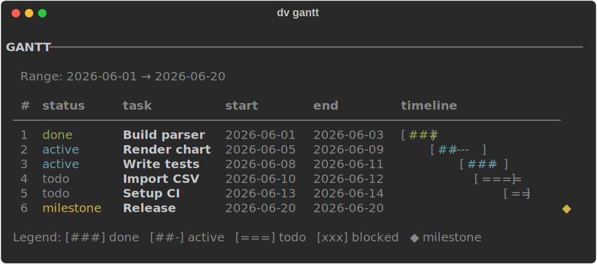
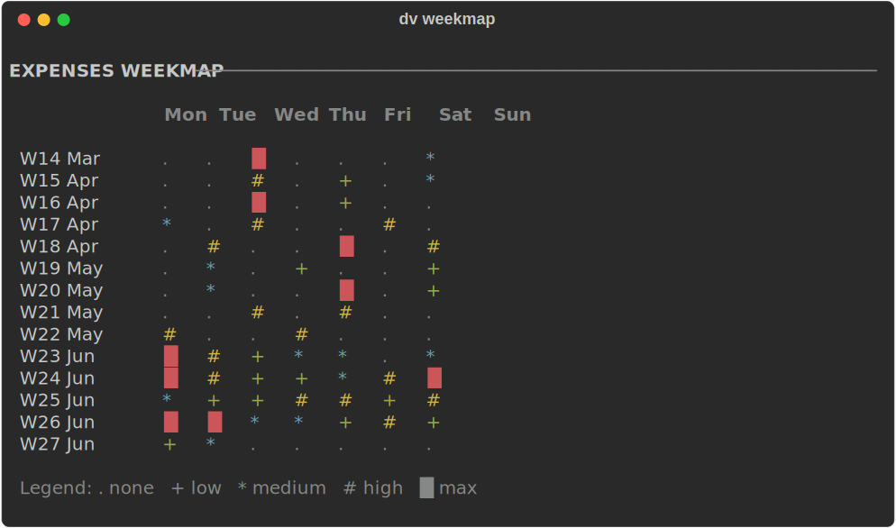
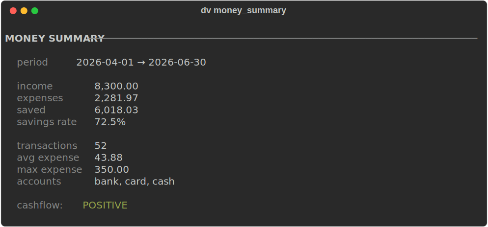
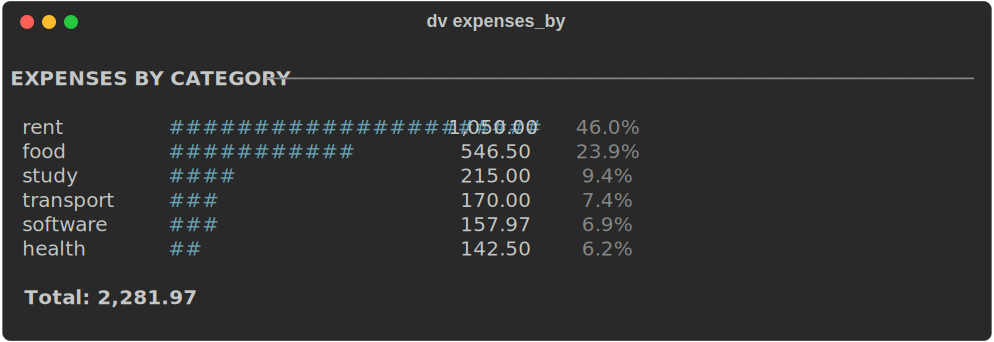
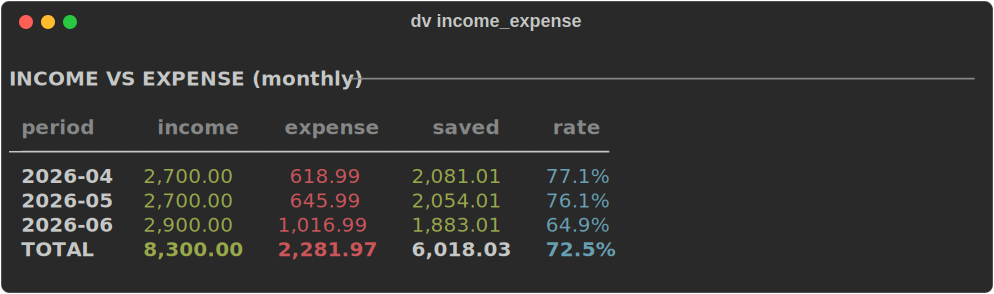
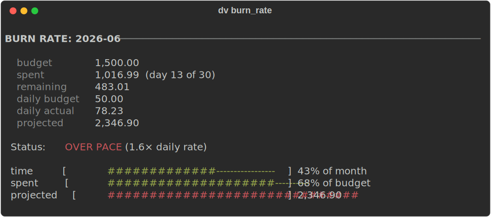
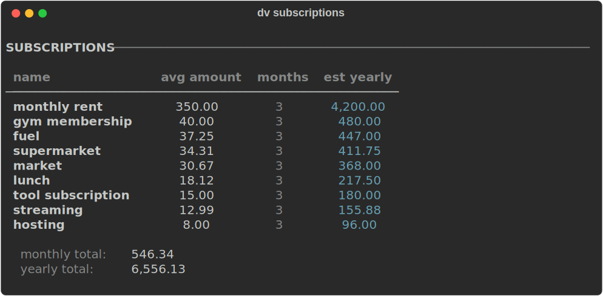

# dv - Personal Terminal DataView

Local-first CLI for inspecting, querying, and visualizing structured data in a terminal.
Powered by DuckDB, rendered with Rich.

```
any file -> summary / query / chart / report
```

No web server. No frontend. Just files and terminal output.

## Install

Requires Python 3.11+ and [uv](https://github.com/astral-sh/uv).

```bash
git clone <repo>
cd dataview
uv sync
uv pip install -e .
```

Run with either:

```bash
uv run dv --help
dv --help
```

## CLI shape

```bash
dv <file> <command> [options]
```

Input files are registered in DuckDB as table `data`, so SQL commands can target that name directly.

## Quick start

```bash
dv examples/expenses.csv schema
dv examples/expenses.csv summary
dv examples/expenses.csv query "SELECT category, sum(amount) AS total FROM data GROUP BY category ORDER BY total DESC"
dv examples/expenses.csv bar category
dv examples/tasks.csv gantt --start start --end end --label task --status status
dv examples/money.csv money-report
```

## Commands

### Inspect and query

- `schema` — column types, missing counts, unique counts
- `head` — first N rows as a table
- `summary` — row count, column types, missing, duplicates, numeric stats
- `describe` — numeric column statistics (min, max, mean, median, std)
- `missing` — missing value counts per column
- `table` — filtered, sorted, paginated table view
- `query` — run raw SQL (table name is `data`)
- `report` — full auto-report: schema + summary + charts

```bash
dv examples/expenses.csv schema
dv examples/expenses.csv head -n 5
dv examples/expenses.csv table --where "amount > 30" --sort amount --desc
dv examples/expenses.csv query "SELECT * FROM data LIMIT 20"
```

### Aggregation

- `group-by` — group by a column with count/sum/avg aggregations
- `pivot` — cross-tab two columns
- `top` — top N values by a numeric column

```bash
dv examples/expenses.csv group-by category --sum amount
dv examples/expenses.csv group-by category --count --bar
dv examples/expenses.csv pivot category date --sum amount
dv examples/expenses.csv top category --by amount
```

### Charts and visuals

- `bar` — horizontal bar chart for a categorical column
- `hist` — histogram of a numeric column
- `spark` — sparkline of a numeric column over time
- `scatter` — ASCII scatter plot of two numeric columns
- `composition` — stacked composition chart (category × period)
- `box` — box plot (min/Q1/median/Q3/max)
- `outliers` — flag statistical outliers in a numeric column
- `heatmap` — density grid (two categorical columns)
- `timeline` — compact ASCII event timeline
- `gantt` — Gantt chart with status, progress, milestones
- `tree` — hierarchical tree from a path column
- `calendar` — monthly calendar heatmap

```bash
dv examples/expenses.csv bar category
dv examples/expenses.csv hist amount --bins 12
dv examples/expenses.csv spark amount --by date
dv examples/tasks.csv gantt --start start --end end --label task --status status --progress progress
dv examples/books.csv tree --path genre/subgenre/title
```

### Time analysis

- `time-summary` — date range, gaps, most active period
- `time` — aggregate by hour/day/week/month/year with optional sum/count/avg
- `by-hour` — count distribution by hour of day
- `streak` — longest consecutive active days
- `gaps` — gaps between events
- `compare-periods` — side-by-side period comparison table
- `weekmap` — week × weekday heatmap grid
- `rolling` — values with rolling average and trend arrows
- `cumulative` — running total with inline progress bars
- `duration` — distribution of durations between two date columns
- `before-after` — compare stats before vs after a cutoff date

```bash
dv examples/expenses.csv time-summary --date date
dv examples/expenses.csv time --date date --by month --sum amount
dv examples/expenses.csv by-hour --date date
dv examples/expenses.csv weekmap --date date --value amount
dv examples/expenses.csv rolling --date date --value amount --window 7
dv examples/expenses.csv cumulative --date date --value amount
dv examples/tasks.csv duration --start start --end end
dv examples/expenses.csv before-after --date date --value amount --cutoff 2026-04-01
dv examples/expenses.csv compare-periods --date date --value amount --period month
```

### Money analysis

Designed for files with `date`, `type` (income/expense), `category`, and `amount` columns.
All commands degrade gracefully when the `type` column is absent.

- `money-summary` — income, expenses, saved, savings rate, cashflow status
- `expenses-by` — bar chart of expenses by any column (default: category)
- `income-expense` — monthly income vs expense table with saved and rate
- `largest` — top N transactions by amount
- `budget` — actual vs budgeted per category (reads from `.dv.yml`)
- `burn-rate` — daily pace vs budget with projected end-of-month spend
- `savings-rate` — savings rate trend table with sparkline
- `subscriptions` — auto-detect recurring payments (appear in 2+ months)
- `money-report` — full report: summary + category bars + budget + largest + cashflow

```bash
dv examples/money.csv money-summary
dv examples/money.csv expenses-by category
dv examples/money.csv income-expense
dv examples/money.csv largest --n 10
dv examples/money.csv burn-rate --month 2026-06 --budget 1500
dv examples/money.csv savings-rate
dv examples/money.csv subscriptions --min-months 2
dv examples/money.csv money-report --month 2026-06
```

### Compare and export

- `diff` — compare two files by a key column
- `export-md` — export summary + charts to a Markdown file

```bash
dv examples/expenses.csv diff examples/study.csv --key date
dv examples/expenses.csv export-md report.md
```

## Screenshots











## Supported formats

| Extension | Format |
|-----------|--------|
| `.csv` | CSV |
| `.tsv` | TSV |
| `.json` | JSON |
| `.jsonl` / `.ndjson` | Newline-delimited JSON |
| `.parquet` | Parquet |
| `.sqlite` / `.db` | SQLite |
| `.duckdb` | DuckDB |

## Config

Optional `.dv.yml` in the project directory or `~/.dv.yml`:

```yaml
default_limit: 50
date_format: "%Y-%m-%d"
charts:
  width: 60
aliases:
  money:
    group_by: category
    sum: amount
```

## Development

Run tests:

```bash
uv run pytest
```

Project layout:

```text
dv/
  main.py           CLI commands (Typer)
  core/             Detection, query, schema, stats, config
  render/           Terminal tables and chart renderers
  tui/              Reserved for later interactive mode
examples/           Sample datasets
tests/              Unit tests
```

## Stack

- [Typer](https://typer.tiangolo.com/) - CLI framework
- [Rich](https://github.com/Textualize/rich) - terminal rendering
- [DuckDB](https://duckdb.org/) - analytics query engine
- [Pandas](https://pandas.pydata.org/) - normalization helpers
- [uv](https://github.com/astral-sh/uv) - environment and package management
