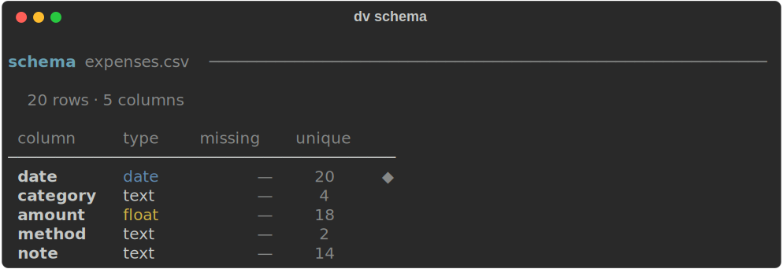
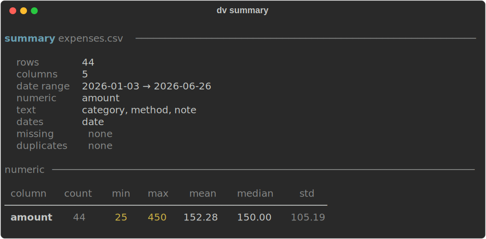
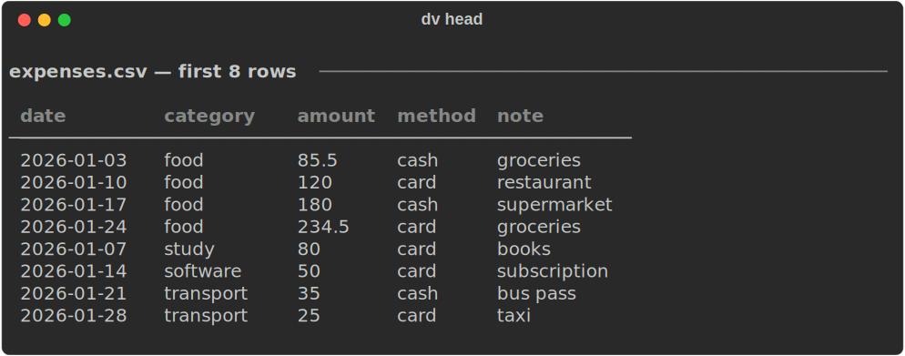
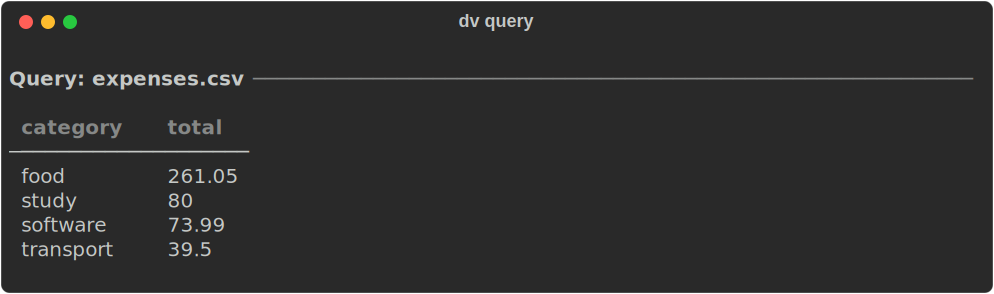
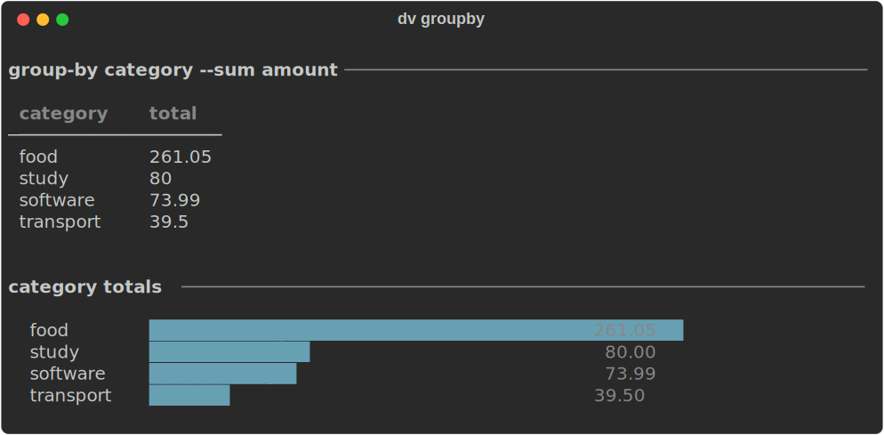
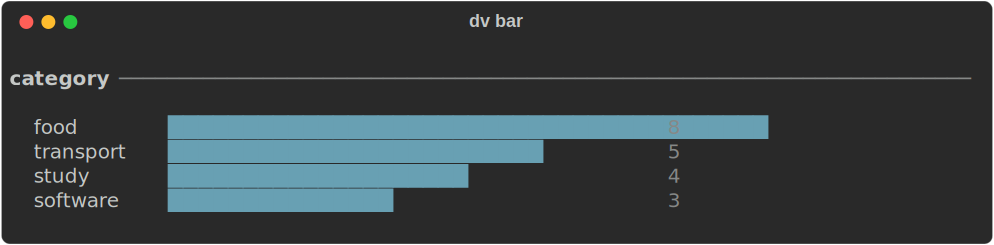
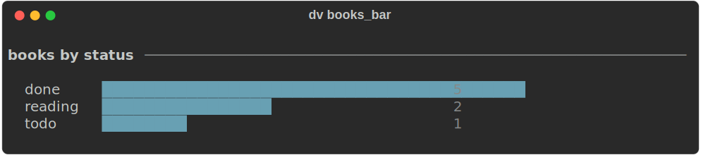
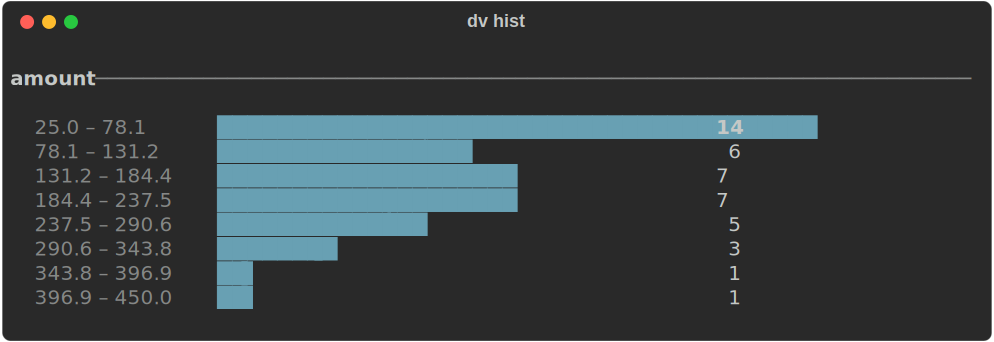
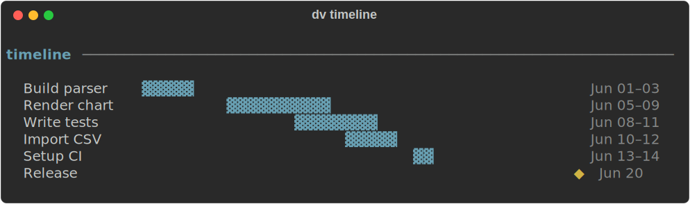

# dv — Personal Terminal DataView

A local-first CLI for inspecting, querying, and visualizing structured data files in the terminal. Powered by DuckDB. No server, no web UI, no dependencies beyond Python.

```
any file → summary / query / chart / report
```

---

## Install

Requires Python 3.11+ and [uv](https://github.com/astral-sh/uv).

```bash
git clone <repo>
cd dataview
uv sync
uv pip install -e .
```

Then use `uv run dv` or activate the venv (`source .venv/bin/activate`) and run `dv` directly.

---

## Usage

```
dv <file> <command> [options]
```

Every file is loaded into DuckDB as a table named `data`. All commands work against that table.

---

## Commands

### `schema` — column types and cardinality

```bash
dv expenses.csv schema
```



---

### `summary` — file overview and numeric stats

```bash
dv expenses.csv summary
```



---

### `head` — first N rows

```bash
dv expenses.csv head
dv expenses.csv head -n 5
```



---

### `query` — raw SQL

```bash
dv expenses.csv query "SELECT category, sum(amount) total FROM data GROUP BY category ORDER BY total DESC"
```



---

### `group-by` — aggregate by column

```bash
dv expenses.csv group-by category --sum amount
dv expenses.csv group-by category --count
dv expenses.csv group-by category --avg amount
dv expenses.csv group-by category --sum amount --bar
```



---

### `bar` — bar chart of value counts

```bash
dv expenses.csv bar category
dv books.csv bar status
```





---

### `hist` — histogram of a numeric column

```bash
dv expenses.csv hist amount
dv expenses.csv hist amount --bins 15
```



---

### `timeline` — Gantt-style chart

```bash
dv tasks.csv timeline --start start --end end --label task
```



---

### `table` — filtered table view

```bash
dv expenses.csv table --limit 20
dv expenses.csv table --where "amount > 30" --sort amount --desc
dv expenses.csv table --columns date,category,amount
```

### `top` — top N by a numeric sum

```bash
dv expenses.csv top category --by amount
```

### `spark` — sparkline of a numeric column

```bash
dv expenses.csv spark amount --by date
```

### `heatmap` — two-dimensional heatmap

```bash
dv data.csv heatmap weekday hour
```

### `missing` — missing value audit

```bash
dv expenses.csv missing
```

### `export-md` — markdown report

```bash
dv expenses.csv export-md report.md
```

Generates a full markdown report with summary, schema, and bar chart.

---

## Supported formats

| Extension | Format |
|-----------|--------|
| `.csv` | CSV |
| `.tsv` | TSV |
| `.json` | JSON |
| `.jsonl` / `.ndjson` | Newline-delimited JSON |
| `.parquet` | Parquet |
| `.sqlite` / `.db` | SQLite |
| `.duckdb` | DuckDB |

---

## Config

Optional `.dv.yml` in the project directory or `~/.dv.yml`:

```yaml
default_limit: 50
date_format: "%Y-%m-%d"
charts:
  width: 60
```

---

## Project layout

```
dv/
  main.py           CLI commands (Typer)
  core/
    datasource.py   DataSource and ResultView types
    detect.py       Format detection
    query.py        DuckDB connection and query runner
    schema.py       Column type inference
    stats.py        Summary statistics
    config.py       Config file loader
  render/
    table.py        Rich table renderer
    summary.py      Schema and summary output
    charts.py       Bar chart and sparkline
    histogram.py    Histogram
    timeline.py     Gantt-style timeline
    heatmap.py      2D heatmap
    tree.py         Hierarchy tree
    export.py       Markdown report generator
examples/
  expenses.csv
  tasks.csv
  books.csv
tests/              26 unit tests
```

---

## Stack

- [Typer](https://typer.tiangolo.com/) — CLI framework
- [Rich](https://github.com/Textualize/rich) — terminal rendering
- [DuckDB](https://duckdb.org/) — analytics query engine
- [uv](https://github.com/astral-sh/uv) — package management
