# dv - Personal Terminal DataView

Local-first CLI for inspecting, querying, and visualizing structured data in a terminal.
Powered by DuckDB, rendered with Rich.

```
any file -> summary / query / chart / report
```

No web server. No frontend. Just files and terminal output.

## Install

Requires Python 3.11+ and [uv](https://github.com/astral-sh/uv).

```bash
git clone <repo>
cd dataview
uv sync
```

Run with:

```bash
uv run dv --help
```

## CLI shape

```bash
dv <file> <command> [options]
```

Input files are registered in DuckDB as table `data`, so SQL commands can target that name directly.

Global flags:

```bash
--unicode          draw charts with Unicode block glyphs
--ascii            plain ASCII (the default)
--json             emit the command's data as JSON instead of drawing it
--where, -w <sql>  filter the rows every command sees
--table <name>     pick a table inside a multi-table SQLite/DuckDB file
--format, -f <fmt> read the input as this format instead of guessing
```

Global flags go before the input file: `dv --unicode expenses.csv bar category`.
Putting one after it is an error that tells you so.

### Reading from a pipe

`-` in place of the filename reads stdin, so `dv` sits in the middle of a
pipeline as easily as at the end of one:

```bash
curl -s https://example.com/export.csv | dv - summary
zcat logs.csv.gz | dv - bar level
psql -c "copy (select ...) to stdout csv header" | dv - hist duration
```

The format is guessed from the content - CSV, TSV, JSON, NDJSON, Parquet and
gzip of any of them all arrive without an extension to read. When the guess is
wrong, or a file on disk has a misleading name, say so:

```bash
dv --format csv access_log summary
```

The `-` is optional when the first word is a command, so this works too:

```bash
cat expenses.csv | dv bar category
```

dv reads its input several times - schema, then the query, then the aggregates
- so a pipe is spooled to a temporary file first. It is streamed there in
chunks and deleted on exit, so piping something larger than memory is fine.

### Many files at once

A pattern in place of the filename reads every file it matches as one table:

```bash
dv 'logs/2026-*.csv' summary
dv 'exports/**/*.parquet' group-by category --sum amount
dv logs/*.csv bar level          # unquoted works too; the shell expands it
```

Files are read in sorted order, so `2026-01` comes before `2026-02`. Every row
carries a `filename` column naming the file it came from, which is usually the
first thing you want to know:

```bash
dv 'logs/*.csv' group-by filename --count
dv 'logs/*.csv' table --where "filename = 'jan.csv'"
```

Columns are matched by name, so a file with an extra column contributes it and
the others read `NULL` there - nothing is dropped for not being in the first
file. `summary` reports how many files it read, so you can check the pattern
caught what you meant. Every file has to be the same format; mixing them is an
error that says which are which.

(If your data already has a `filename` column, the tag is called `_filename`
instead so yours is left alone.)

### JSON output

`--json` makes every command that renders data emit that data instead of
drawing it, so `dv` composes with `jq` and friends:

```bash
dv --json examples/expenses.csv group-by category --sum amount | jq '.[0].total'
dv --json examples/books.csv schema | jq -r '.columns[] | select(.missing > 0) | .name'
dv --json examples/money.csv money-summary | jq -r '"saved \(.saved) at \(.savings_rate|round)%"'
dv --json examples/expenses.csv bar category | jq -r '.[] | [.label, .value] | @csv'
```

What you get is the data behind the picture, never the picture: `bar` gives
labels and values, `hist` gives bin edges and counts, `box` gives the five
numbers, `streak` gives the streak rather than the rows it was computed from.

stdout carries the JSON document and nothing else - warnings, errors and the
row-cap notice all go to stderr, so a pipeline stays clean. Commands that
produce several sections (`report`) return an object keyed by section name;
everything else returns its rows or its object directly. The two exporters
write a file rather than a stream, so they have no JSON form.

### Filtering

`--where` takes a SQL condition and applies it as `data` is loaded, so every
command - charts, reports and raw `query` included - sees only the matching
rows. It saves dropping to SQL and losing the renderer:

```bash
dv --where "amount > 100" examples/expenses.csv summary
dv --where "category = 'food'" examples/expenses.csv bar method
dv -w "date >= '2026-06-01'" examples/money.csv money-report
```

It composes with `table --where`, which narrows further, and exported reports
record the filter they were built with.

Output is ASCII by default so it stays readable when piped to a file, viewed in
a plain terminal, or read by a screen reader. `--unicode` switches on block
glyphs and box drawing.

Set `DV_TRACEBACK=1` to see the full Python traceback instead of a one-line
error message.

## Quick start

```bash
dv examples/expenses.csv schema
dv examples/expenses.csv summary
dv examples/expenses.csv query "SELECT category, sum(amount) AS total FROM data GROUP BY category ORDER BY total DESC"
dv examples/expenses.csv bar category
dv examples/tasks.csv gantt --start start --end end --label task --status status
dv examples/money.csv money-report
```

## Commands

### Inspect and query

- `schema` — column types, missing counts, unique counts
- `head` — first N rows as a table
- `summary` — row count, column types, missing, duplicates, numeric stats
- `describe` — numeric column statistics only (count, min, max, mean, median, std)
- `missing` — missing value counts per column
- `table` — filtered, sorted, paginated table view
- `query` — run raw SQL (table name is `data`)
- `report` — full auto-report: schema + summary + charts

```bash
dv examples/expenses.csv schema
dv examples/expenses.csv head -n 5
dv examples/expenses.csv table --where "amount > 30" --sort amount --desc
dv examples/expenses.csv query "SELECT * FROM data LIMIT 20"
```

`query` renders at most 200 rows by default and reports how many matched
(`showing 200 of 3,000,000 rows`). Raise it with `--limit`, or pass `--all` to
render everything.


### Aggregation

- `group-by` — group by a column with count/sum/avg aggregations
- `pivot` — cross-tab two columns
- `top` — top N values by a numeric column

```bash
dv examples/expenses.csv group-by category --sum amount
dv examples/expenses.csv group-by category --count --bar
dv examples/expenses.csv pivot category date --sum amount
dv examples/expenses.csv top category --by amount
```

### Charts and visuals

- `bar` — horizontal bar chart for a categorical column
- `hist` — histogram of a numeric column
- `spark` — sparkline of a numeric column over time (`--width` glyphs)
- `scatter` — ASCII scatter plot of two numeric columns
- `composition` — stacked composition chart (category × period)
- `box` — box plot (min/Q1/median/Q3/max)
- `outliers` — flag statistical outliers in a numeric column
- `heatmap` — density grid (two categorical columns)
- `timeline` — compact ASCII event timeline
- `gantt` — Gantt chart with status, progress, milestones
- `tree` — hierarchical tree from a path column
- `calendar` — monthly calendar heatmap

```bash
dv examples/expenses.csv bar category
dv examples/expenses.csv hist amount --bins 12
dv examples/expenses.csv spark amount --by date
dv examples/tasks.csv gantt --start start --end end --label task --status status --progress progress
dv examples/books.csv tree --path category/status/title
```

### Time analysis

- `time-summary` — date range, gaps, most active period
- `time` — aggregate by hour/day/week/month/year with optional sum/count/avg
- `by-hour` — count distribution by hour of day
- `streak` — longest consecutive active days
- `gaps` — gaps between events
- `compare-periods` — side-by-side period comparison table
- `weekmap` — week × weekday heatmap grid
- `rolling` — values with rolling average and trend arrows
- `cumulative` — running total with inline progress bars
- `duration` — distribution of durations between two date columns
- `before-after` — compare stats before vs after a cutoff date

```bash
dv examples/expenses.csv time-summary --date date
dv examples/expenses.csv time --date date --by month --sum amount
dv examples/expenses.csv by-hour --date date
dv examples/expenses.csv weekmap --date date --value amount
dv examples/expenses.csv rolling --date date --value amount --window 7
dv examples/expenses.csv cumulative --date date --value amount
dv examples/tasks.csv duration --start start --end end
dv examples/expenses.csv before-after --date date --value amount --cutoff 2026-04-01
dv examples/expenses.csv compare-periods --date date --value amount --period month
```

### Money analysis

Designed for files with `date`, `type` (income/expense), `category`, and `amount` columns.
All commands degrade gracefully when the `type` column is absent.

- `money-summary` — income, expenses, saved, savings rate, cashflow status
- `expenses-by` — bar chart of expenses by any column (default: category)
- `income-expense` — monthly income vs expense table with saved and rate
- `largest` — top N transactions by amount
- `budget` — actual vs budgeted per category (reads a `--budget <file>.yml`)
- `burn-rate` — daily pace vs budget with projected end-of-month spend
- `savings-rate` — savings rate trend table with sparkline
- `subscriptions` — auto-detect recurring payments (appear in 2+ months)
- `money-report` — full report: summary + category bars + budget + largest + cashflow

```bash
dv examples/money.csv money-summary
dv examples/money.csv expenses-by category
dv examples/money.csv income-expense
dv examples/money.csv largest --limit 10
dv examples/money.csv budget category --budget examples/budget.yml
dv examples/money.csv burn-rate --month 2026-06 --budget 1500
dv examples/money.csv savings-rate
dv examples/money.csv subscriptions --min-months 2
dv examples/money.csv money-report --month 2026-06
```

### Compare and export

- `diff` — compare two files by a key column
- `export-md` — export summary + charts to a Markdown file
- `export-html` — the same report as a self-contained HTML page
- `alias` — run a saved view from `.dv.yml`

```bash
dv examples/expenses.csv diff examples/money.csv --key date
dv examples/expenses.csv export-md report.md
dv examples/expenses.csv export-html report.html
dv examples/expenses.csv alias money
```

## Screenshots

Generated with `--unicode`; the default output uses plain ASCII.

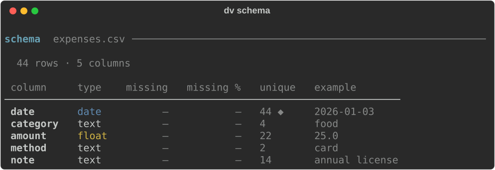
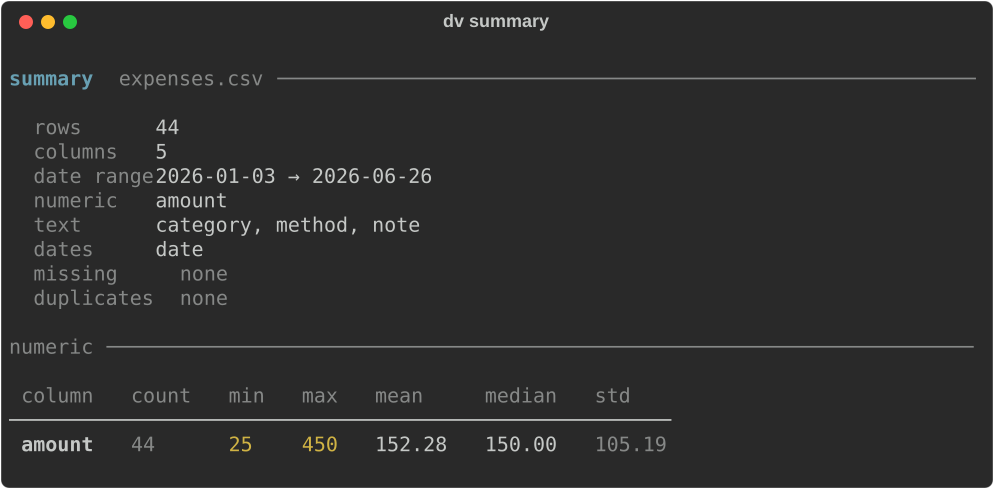
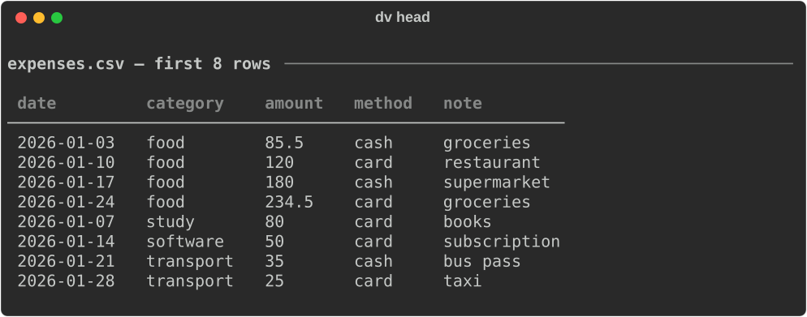
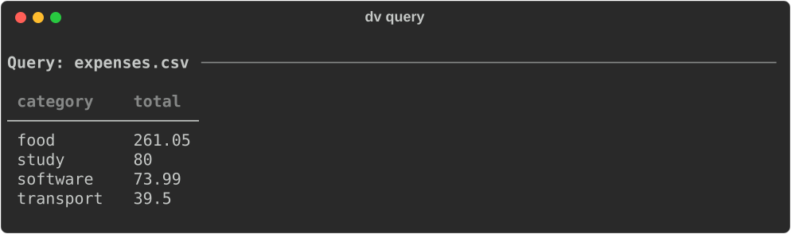
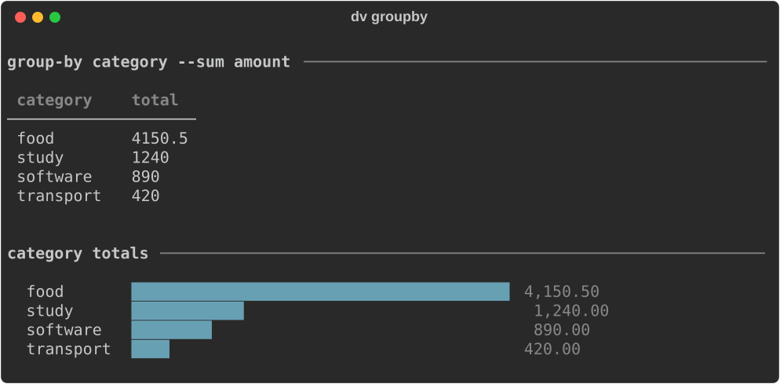
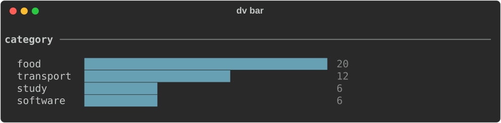
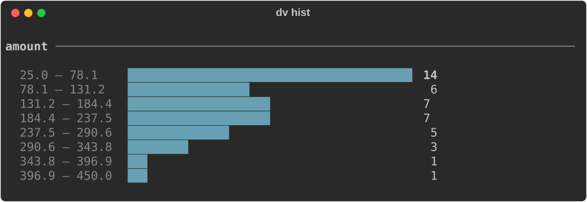
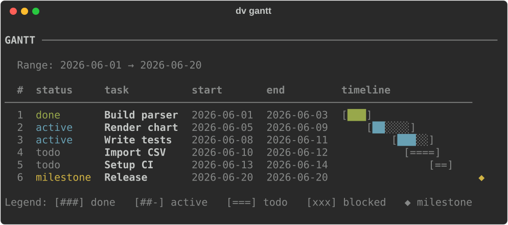
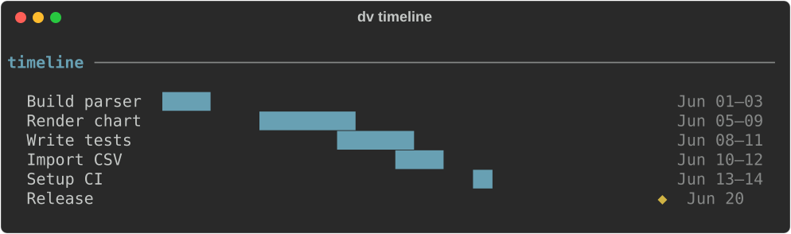
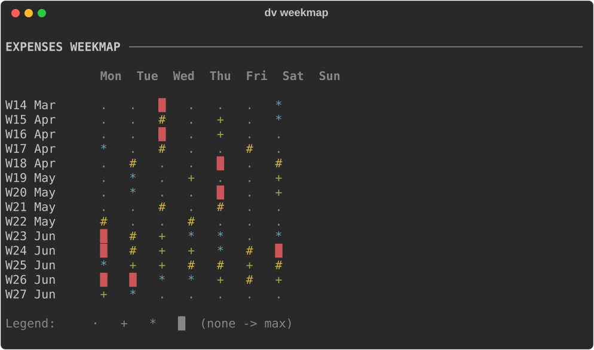
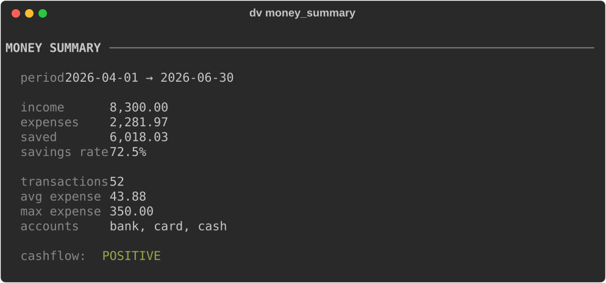
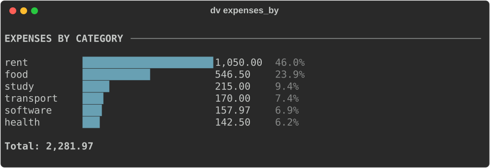
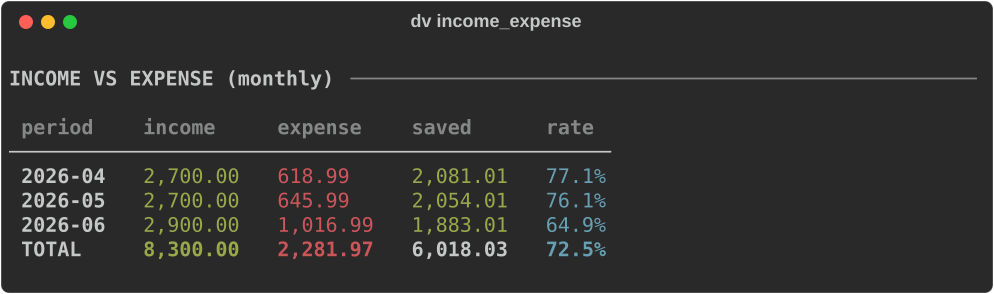
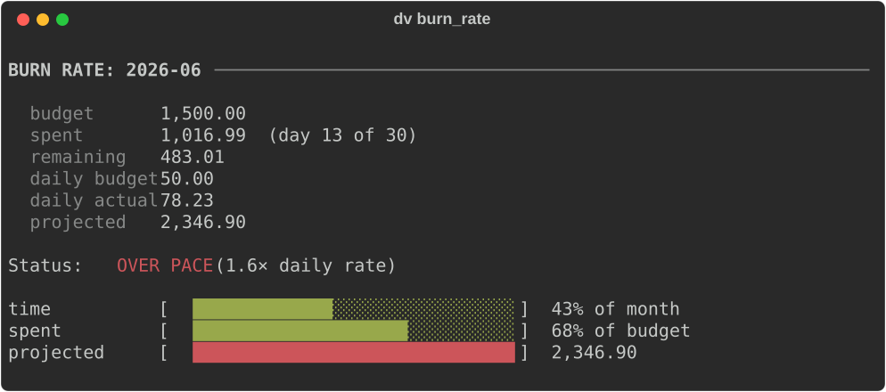
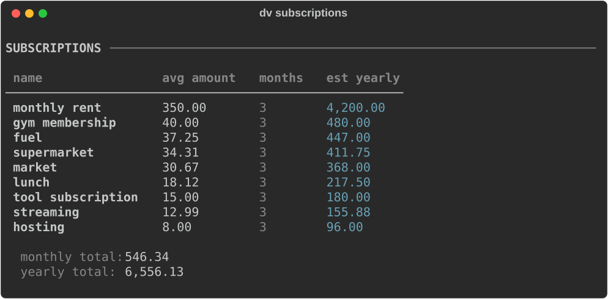

## Working on large files

Charts aggregate in DuckDB rather than in Python, so what comes back is bounded
by the size of the chart, not the size of the file. On a 3 million row CSV:

| Command | Before | After |
|---------|--------|-------|
| `query "select * from data"` | did not finish | 0.6s |
| `spark amount` | 36s, 4.1 GB | 0.5s, 296 MB |
| `hist amount` | 3.2s, 1.2 GB | 0.6s, 271 MB |
| `head -n 3` | 0.59s, 265 MB | 0.36s, 107 MB |

Commands that only need a peek at the start of the file - `head`, `table` and a
capped `query` - register the input as a view, so DuckDB pushes their `LIMIT`
into the scan instead of parsing every row first. Commands that query the source
repeatedly still parse it once into memory.

Small inputs are unaffected: `scatter` still plots every point exactly below
20,000 rows, and chart output is byte-for-byte what it was.

Converting a file you query often to Parquet is the biggest single win - DuckDB
aggregates over it about 30x faster than over the equivalent CSV:

```bash
dv data.csv query "COPY data TO 'data.parquet' (FORMAT PARQUET)" --all
dv data.parquet summary
```

## Supported formats

| Extension | Format |
|-----------|--------|
| `.csv` | CSV |
| `.tsv` | TSV |
| `.json` | JSON |
| `.jsonl` / `.ndjson` | Newline-delimited JSON |
| `.parquet` | Parquet |
| `.sqlite` / `.db` | SQLite |
| `.duckdb` | DuckDB |

Text formats also read gzipped: `.csv.gz`, `.tsv.gz`, `.json.gz`, `.jsonl.gz`.

A SQLite or DuckDB file with one table loads it as `data`. With several, pass
`--table <name>` to choose; the others stay queryable under their own names, so
`query` can join across them:

```bash
dv --table orders shop.db schema
dv --table orders shop.db query "SELECT c.name FROM data o JOIN customers c ON o.customer_id = c.id"
```

## Config

Optional `.dv.yml`, looked up next to the input file, then in the working
directory, then at `~/.dv.yml`. The first file found wins.

```yaml
default_limit: 50        # rows when a command has no --limit of its own
unicode: false           # overridden by --unicode / --ascii
date_format: "%Y-%m-%d"  # how dates are displayed
charts:
  width: 60              # default chart width
aliases:                 # saved views, run with: dv <file> alias <name>
  money:
    group_by: category
    sum: amount
  methods:
    group_by: method
    sum: amount
    limit: 10
```

```bash
dv examples/expenses.csv alias money
```

`budget` is separate: it takes an explicit `--budget <file>.yml` of
`category: amount` entries (see `examples/budget.yml`).

## Development

Run tests:

```bash
uv run pytest
```

Project layout:

```text
dv/
  main.py           CLI commands (Typer)
  core/             Detection, query, schema, stats, config
  render/           Terminal tables and chart renderers
  tui/              Reserved for later interactive mode
examples/           Sample datasets
tests/              Unit tests
```

## Stack

- [Typer](https://typer.tiangolo.com/) - CLI framework
- [Rich](https://github.com/Textualize/rich) - terminal rendering
- [DuckDB](https://duckdb.org/) - analytics query engine
- [Pandas](https://pandas.pydata.org/) - normalization helpers
- [uv](https://github.com/astral-sh/uv) - environment and package management
